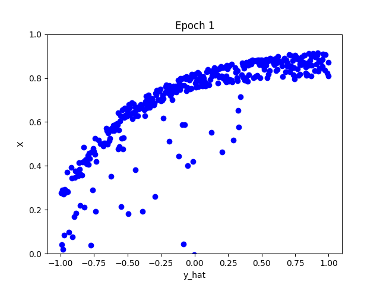
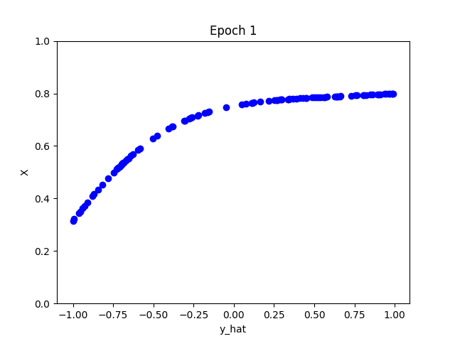

# Machine Learning Implementations
Machine Learning implementations in Python with Numpy.

# Overview
Attempts at Numpy implementations of Deep Learning + Machine Learning methods. The deep learning section intends to work cohesively with all DL layers, providing a way to build models and easily implement new module types. For more information, go to the `deep_learning` folder.

The machine learning section is a work in progress, with the goal of implementing decision trees and other ML algorithms. My main focus is on the deep learning section.

**AIM:** Better understand inner working of ML/DL methods.

## Examples Visuals
Below are some visualizations from the `deep_learning/visuals` folder ->

>*Outputs on training set at each epoch.*


>*Outputs on testing set at each epoch.*


## File Structure

```bash
.
├── README.md
├── deep_learning
    ├── examples
    ├── visuals
    ├── activation_functions.py
    ├── layers.py
    ├── linear_regression.py
    ├── loss_functions.py
    ├── models.py
    ├── optimizers.py
    ├── utils.py
├── decision_trees
    ├── impurities
        ├── impurities.py
    ├── tree
        ├── __init__.py
        ├── node.py
        ├── tree.py
```

# To Do

| # | Task                                                                                  | Status       |
|---------|-----------------------------------------------------------------------------------------------------|--------------|
| 1       | Test dense network | In Progress  |
| 3       | Implement 2d conv layers                                                                                   | In Progress      |
| 4       | Decision trees                                                                                    | Pending      |
